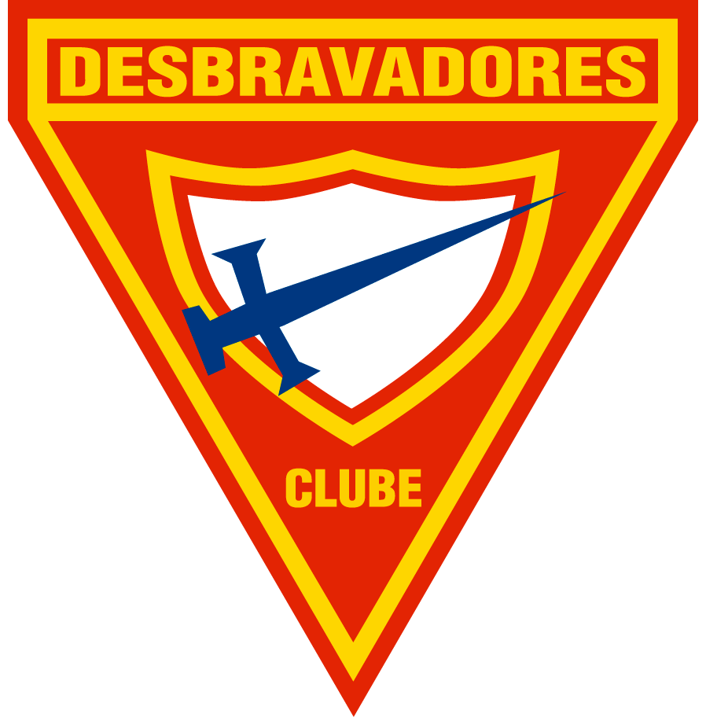
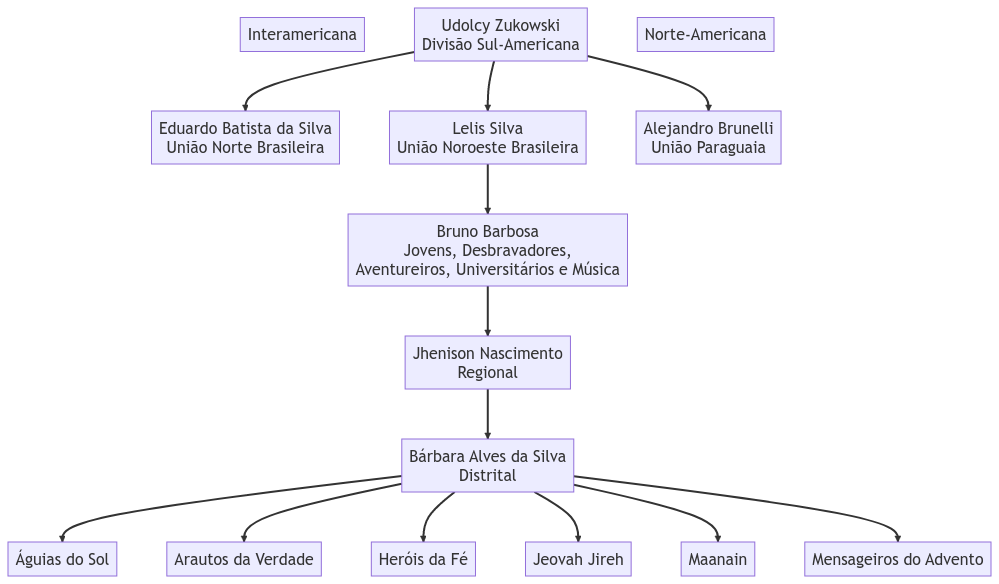
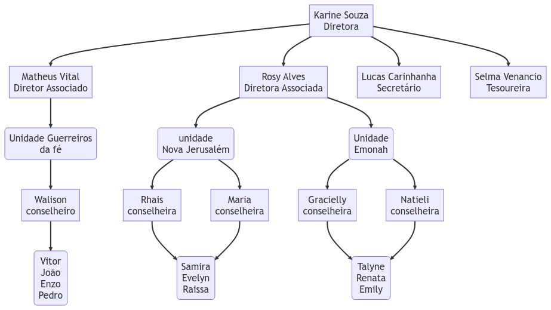
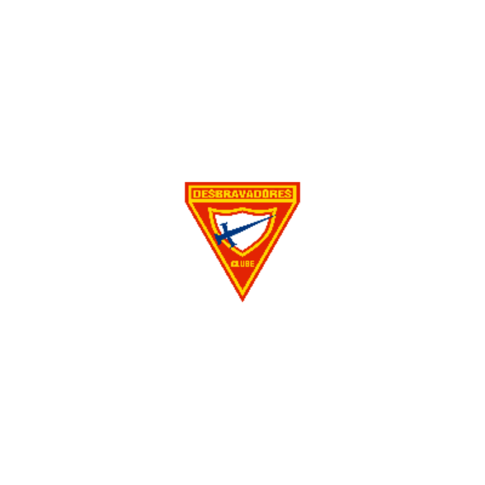

#### **Filosofia, Estrutura e Organização do clube de Desbravadores**

 

Lucas Carinhanha de Araujo    - Arautos da verdade -

<!-- [car1nhanha](https://github.com/car1nhanha/apresentation_dbv) -->

---

#### Origem do Clube de Desbravadores

- 1852 - Tiago White publica o periódico _The Youth's Instructor_ [O Instrutor da Juventude].
- 1922 - Primeiras classes adicionadas
- 1928 - Primeiras 16 especialidades adicionadas
- 1932 - Primeiro "Acampamento dos Desbravadores" - Califórnia, EUA.
- 1946 - Criação do Triângulo dos Desbravadores
- 1948 - Criação do Hino por Henry Berg
- 1950 - A assembleia da Associação Geral vota a implantação do Clube de Desbravadores em todo o mundo.
- 1953 - I Campori de Desbravadores

---

### Organização e Estrutura do Clube

> Cada Clube de Desbravadores é administrado por um Diretor, Diretores Associados, Conselheiros, Instrutores, Capelão, Secretário e Tesoureiro.
>  

Fonte: [Manual Administrativo do Clube de Desbravadores, p. 76](https://deptos.adventistas.org/desbravadores/ManualAdministrativoDesbravadores.pdf)

---

#### Nomeação da Diretoria

> A indicação do Diretor e Diretores Associados é realizada anualmente pela Comissão de Nomeações da Igreja local.
>  

Fonte: [Manual Administrativo do Clube de Desbravadores, p. 77](https://deptos.adventistas.org/desbravadores/ManualAdministrativoDesbravadores.pdf)

---

#### Espiritualidade do Diretor

> O diretor deve ter, no mínimo, 18 anos de idade, ser uma pessoa madura e membro regular da Igreja Adventista do Sétimo Dia. Ele deve concluir o curso de treinamento básico de diretoria (TDB) [...] >  

 

Fonte: [Manual Administrativo do Clube de Desbravadores, p. 77](https://deptos.adventistas.org/desbravadores/ManualAdministrativoDesbravadores.pdf)

---

#### Funções do Diretor

- Ser membro da Comissão da Igreja
- Exercer a direção superior da administração do Clube
- Convocar e presidir a Comissão Executiva e a Comissão Regular
- Providenciar todo o material e local para a realização de eventos
- Definir as diretrizes e metas do Clube para o ano corrente
- Dirigir todas as reuniões do Clube

---

#### Funções dos Diretores Associados:

- Coordenar e fiscalizar todo o trabalho com as Unidades
- Coordenar o esquema de instrução de Classes e Especialidades junto aos Instrutores
- Substituir o diretor em sua ausência ou solicitação

---

#### Funções do Secretário

- Registrar todos os pontos e deméritos
- Preencher o relatório trimestral
- Notificar o diretor se um Desbravador começa a faltar com certa frequência
- Manter um sistema de comunicação com o Clube
- Requisitar materiais e formulários de relatório da Associação
- Manter em dia o livro de atas, atos e o sistema de secretaria

---

#### Demais cargos da direção

- Tesouraria
- Capelania
- Instrutores
- Conselheiros

---

### Estrutura Organizacional

---

### Estrutura Organizacional

---

## Filosofia

---

> O homem é a obra-prima do Deus Criador aqui na terra. Foi criado à Sua imagem e semelhança, o que significa que é especial diante de toda a criação.

 

Fonte: [Manual Administrativo do Clube de Desbravadores, p. 14](https://deptos.adventistas.org/desbravadores/ManualAdministrativoDesbravadores.pdf)

---

> Como seres humanos, as pessoas agem baseadas em suas crenças e visão de mundo. Essas crenças são essenciais, pois elas norteiam, dão rumo e significado para o que fazem.

 

Fonte: [Manual Administrativo do Clube de Desbravadores, p. 14](https://deptos.adventistas.org/desbravadores/ManualAdministrativoDesbravadores.pdf)

---

> O Clube só será relevante se aprender a pensar de maneira relevante

 

Fonte: [Manual Administrativo do Clube de Desbravadores, p. 15](https://deptos.adventistas.org/desbravadores/ManualAdministrativoDesbravadores.pdf)

---

### Metafísica

> “bem aventurados os que não viram e creram” João 20:29

---

### Epistemologia

> “estudo do conhecimento”

---

### Lógica

> “O ideal máximo da lógica é a coerência. É coerente aquilo que está de acordo com as regras ou condições do sistema” (Antônio Teles, Introdução ao estudo de filosofia, p. 154).

---

### Ética

> “Os preceitos do Senhor são retos”. Salmos 19:8

---

### Estética

> “Por que não posso usar tatuagem, piercing ou pintar o cabelo colorido? Eu acho bonito!”

---

### Política

> “Depois deitou água numa bacia, e começou a lavar os pés aos discípulos, e a enxugar-lhos com a toalha com que estava cingido.” João 13:5

---

### Material da apresentação

