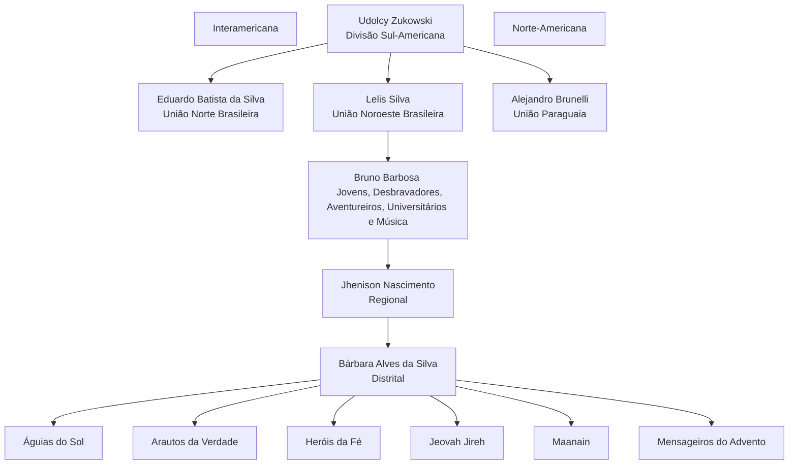
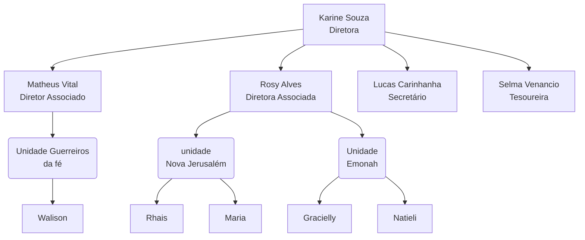

# Pontos para apresentação

Essa apresentação é voltada exclusivamente para os desbravadores. necessáriamente os capitães.

## Descrição

### Introdução ao Clube de Desbravadores

- Origem e propósito do Clube de Desbravadores
- Missão e visão do clube

### Filosofia do Clube de Desbravadores

- Princípios e valores fundamentais
- Desenvolvimento espiritual, físico, mental e social dos jovens
- Fomentar o trabalho em equipe e a liderança

### Estrutura Organizacional

- Níveis de organização: Clube, Associação/Missão, União, Divisão e Mundial

- Liderança do clube: Diretor, Diretor Associado, Secretário, Tesoureiro, Conselheiros e Instrutores

### Atividades e Programas

- Reuniões semanais e acampamentos
- Atividades comunitárias e de serviço
- Eventos especiais e competições

### Sistema de Mérito e Conquistas

- Classes regulares e avançadas
- Especialidades e habilidades
- Reconhecimento e premiação

### Apoio da Igreja e da Comunidade

- Envolvimento e contribuição dos membros da igreja
- Parcerias com organizações locais
- Impacto na comunidade

### Conclusão

- A importância do Clube de Desbravadores na formação dos jovens
- O papel do clube na sociedade
- Compromisso com o crescimento e desenvolvimento do clube

