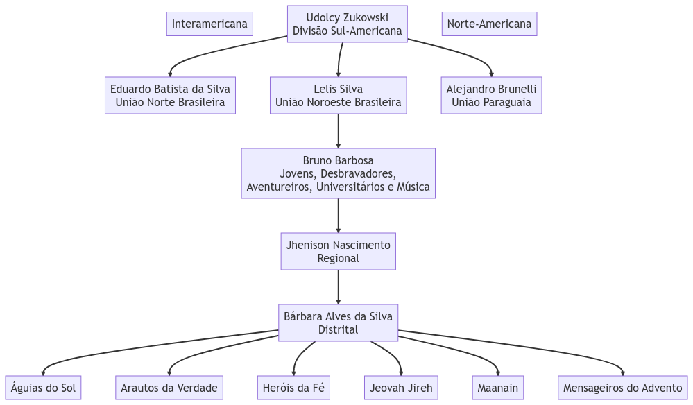

## **Filosofia, Estrutura e Organização do Clube de Desbravadores**

---

### Introdução ao Clube de Desbravadores

##### Origem, propósito e Missão do Clube de Desbravadores

 

- Escoteiro Missionários em 1919
- oficialização de Clube de Desbravadores em 1950

---

### Filosofia do Clube de Desbravadores

- Princípios e valores fundamentais
- Desenvolvimento espiritual, físico, mental e social dos jovens
- Fomentar o trabalho em equipe e a liderança

---

### Estrutura Organizacional

---

### Estrutura Organizacional

- Liderança do clube: Diretor, Diretor Associado, Secretário, Tesoureiro, Conselheiros e Instrutores

<!-- ---

## O que é Filosofia?

> Conjunto de doutrinas, valores e ideias filosóficas de uma época comum a determinado povo ou grupo social...

 

Fonte: [Michaelis - Moderno Dicionário da Língua Portuguesa](https://michaelis.uol.com.br/moderno-portugues/busca/portugues-brasileiro/filosofia)

--- -->
